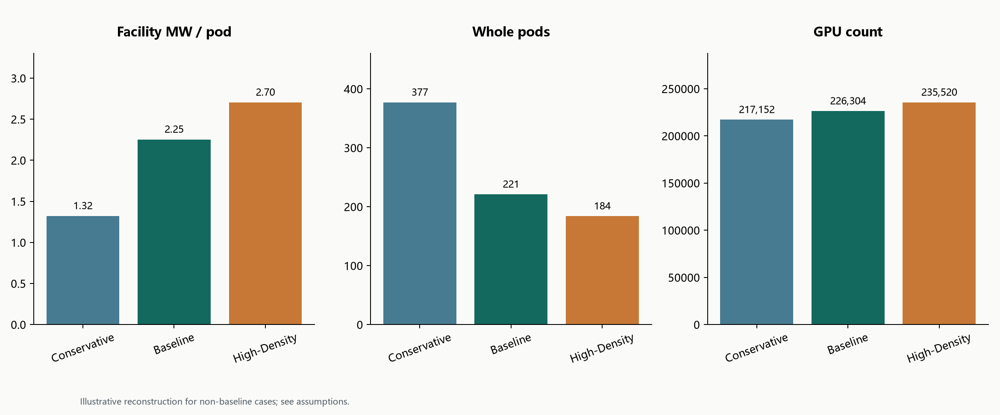
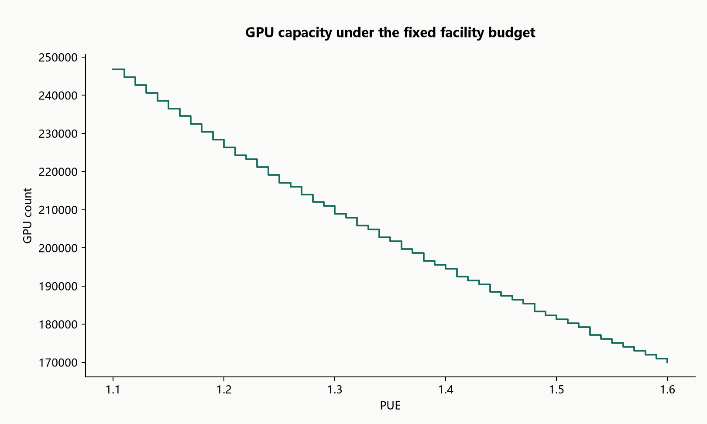

# Data Center GPU Capacity Planning AI Agent

**An AI agent that extends the [Data Center GPU Rack & Pod Power Capacity Planning](https://github.com/AnthonyRui/Data-Center-GPU-Rack-Pod-Power-Capacity-Planning) model with a conversational command-line interface.**

The agent calls deterministic Python tools to calculate GPU rack/pod power and capacity under facility power limits, compare deployment scenarios, analyze PUE sensitivity, and generate plots. It also retrieves explanations and source references from a curated local knowledge corpus. Engineering results come from the calculation tools; the language model coordinates tool calls and explains their outputs.

**Agent extension status: Phase 2A + 2B.** The CLI combines four deterministic engineering tools with local, sourced knowledge retrieval. OpenRouter free models and OpenAI remain supported. Read the [Phase 2 guide](docs/phase2_knowledge.md) and [validation record](docs/phase2_validation.md). The [Phase 1B acceptance record](docs/phase1b_acceptance.md) preserves the earlier milestone.

**Agent 扩展进度：Phase 2A + 2B。** CLI 已将四个确定性工程工具与带来源的本地知识检索结合，继续支持 OpenRouter 免费模型及 OpenAI。详见[Phase 2 使用指南](docs/phase2_knowledge.md)及[验证记录](docs/phase2_validation.md)。[Phase 1B 验收记录](docs/phase1b_acceptance.md)保留先前阶段证据。

## Development Roadmap / 开发路线图

Current status: **Phase 2A + 2B complete**. Phase 1A (four validated engineering tools), Phase 1B (CLI agent, OpenRouter support and live acceptance), and Phase 2A/2B (local sourced knowledge retrieval and conversational integration) are complete. The next planned delivery is Phase 3, beginning with engineering constraints. The roadmap is intentionally staged so each phase is tested and reviewed before the next one starts.

当前状态：**Phase 2A + 2B 已完成**。Phase 1A（四个经过验证的工程工具）、Phase 1B（CLI Agent、OpenRouter 接入及真实验收）以及 Phase 2A/2B（带来源的本地知识检索和对话接入）均已完成。下一阶段计划从工程约束开始，进入 Phase 3。路线图按阶段推进，每个阶段先测试和验收，再进入下一阶段。

| Phase | Status / 状态 | Scope / 范围 |
| --- | --- | --- |
| Phase 1A | Complete / 已完成 | Four deterministic Agent Tools, validation and regression tests / 四个确定性 Agent Tool、校验与回归测试 |
| Phase 1B | Complete / 已完成 | CLI conversation, OpenRouter free routing, plots and live acceptance / CLI 对话、OpenRouter 免费路由、绘图与真实验收 |
| Phase 2A | Complete / 已完成 | Curated bilingual local knowledge corpus and lexical retrieval / 双语本地知识库与词项检索 |
| Phase 2B | Complete / 已完成 | Knowledge tool calling, source panels and mixed calculation flows / 知识工具调用、来源面板与混合计算流程 |
| Phase 3 | Planned / 计划中 | Engineering constraints and reserve-aware capacity planning / 工程约束与考虑预留的容量规划 |
| Phase 4 | Planned / 计划中 | Streamlit Dashboard and 500 MW case study / Streamlit Dashboard 与 500 MW 案例 |
| Phase 5 | Planned / 计划中 | Cooling, UPS, transformer and redundancy constraints / 冷却、UPS、变压器与冗余约束 |
| Phase 6 | Planned / 计划中 | Workload forecasting and real-world PUE data / 工作负载预测与真实 PUE 数据 |
| Phase 7 | Planned / 计划中 | Expanded document-grounded Agent, E2E tests and documentation / 文档增强 Agent、E2E 测试与文档 |
| Phase 8 | Planned / 计划中 | Validated v1.0 release / 经过验收的 v1.0 发布 |

### Phase 3 — Engineering constraints and capacity planning / 工程约束与容量规划

- [ ] Operating Reserve and Growth Reserve calculations, input validation and boundary tests.
- [ ] Partial Pod Allocation and Whole Pod versus Partial Pod comparison.
- [ ] Physical Rack Constraint and joint Power Limit plus Rack Space Limit feasibility checks.
- [ ] Unit tests for every new capacity constraint and clearer bottleneck explanations.
- [ ] Reserve percentage versus GPU capacity, Whole Pod versus Partial Pod, and Rack Density versus Constraint charts.
- [ ] GitHub Release **v0.2 — Engineering Constraints**.

- [ ] Operating Reserve 与 Growth Reserve 计算、输入校验和边界测试。
- [ ] Partial Pod Allocation，以及 Whole Pod 与 Partial Pod 方案对比。
- [ ] Physical Rack Constraint，以及 Power Limit 与 Rack Space Limit 联合约束判断。
- [ ] 为所有新增容量约束增加单元测试，并优化瓶颈原因解释。
- [ ] 增加 Reserve% 与 GPU Capacity、Whole Pod 与 Partial Pod、Rack Density 与 Constraint 图表。
- [ ] 发布 GitHub Release **v0.2 — Engineering Constraints**。

### Phase 4 — Dashboard and case study / Dashboard 与案例研究

- [ ] Create a basic Streamlit Dashboard with Facility MW, PUE, Reserve, Servers/Rack and Racks/Pod inputs.
- [ ] Display Pods, Racks, GPUs, Remaining Power, Scenario Comparison and PUE Sensitivity.
- [ ] Add the new capacity-planning charts, natural-language Capacity Planning input and current AI Agent integration.
- [ ] Add Web UI validation and user-friendly error messages.
- [ ] Build a complete 500 MW Data Center Case Study with charts and result interpretation.
- [ ] Update README with Dashboard screenshot, architecture diagram, Demo instructions, Quick Start and installation instructions.

- [ ] 创建基础 Streamlit Dashboard，加入 Facility MW、PUE、Reserve、Servers/Rack、Racks/Pod 输入。
- [ ] 展示 Pods、Racks、GPUs、Remaining Power、Scenario Comparison 和 PUE Sensitivity。
- [ ] 加入新增容量规划图表、自然语言 Capacity Planning 输入，并接入现有 AI Agent。
- [ ] 增加 Web UI 输入校验和错误提示。
- [ ] 完成 500 MW Data Center Case Study，并配套图表和结果解释。
- [ ] 更新 README，加入 Dashboard 截图、架构图、Demo、Quick Start 和安装说明。

### Phase 5 — Facility equipment and redundancy constraints / 设备与冗余约束

- [ ] Cooling Capacity, UPS Capacity and Transformer Capacity constraints.
- [ ] N+1 / 2N redundancy model and joint Power, Cooling and Rack Space bottleneck analysis.
- [ ] Real equipment parameter configuration files and GPU Server / Rack / Pod Profile management.

- [ ] Cooling Capacity、UPS Capacity 与 Transformer Capacity 约束。
- [ ] N+1 / 2N 冗余模型，以及 Power、Cooling、Rack Space 多约束联合瓶颈判断。
- [ ] 真实设备参数配置文件，以及 GPU Server / Rack / Pod Profile 管理。

### Phase 6 — Forecasting and live data / 预测与实时数据

- [ ] Time-Series Workload simulation and Capacity Forecast under different load levels.
- [ ] Real-world PUE data interface or data import.

- [ ] Time-Series Workload 模拟，以及不同负载水平下的 Capacity Forecast。
- [ ] Real-world PUE 数据接口或数据导入。

### Phase 7 — Document-grounded engineering Agent / 文档增强工程 Agent

- [ ] Expand RAG to read approved data-center technical documents.
- [ ] Let the Agent answer engineering parameter and design-constraint questions with local source citations.
- [ ] Add complete End-to-End tests, GitHub Actions automated testing, Demo data and example scenarios.
- [ ] Add complete Architecture Documentation, Limitations and Engineering Assumptions documentation.

- [ ] 扩展 RAG，读取经过许可的数据中心技术文档。
- [ ] 让 Agent 根据文档回答工程参数和设计约束问题，并附本地来源引用。
- [ ] 增加完整 End-to-End 测试、GitHub Actions 自动测试、Demo 数据和示例场景。
- [ ] 增加完整 Architecture Documentation、Limitations 和 Engineering Assumptions 文档。

### Phase 8 — Release / 发布

- [ ] Publish the complete **v1.0** release after all preceding phases are independently validated.

- [ ] 在前述阶段分别验收通过后发布完整 **v1.0**。

The roadmap records planned work; unchecked items are not implemented or promised in the current release. Detailed electrical design and other unsupported engineering decisions remain outside the model until their constraints and sources are explicitly implemented and tested.

路线图记录计划工作；未勾选项目尚未在当前版本实现，也不代表已承诺交付。详细电气设计及其他不支持的工程决策，必须在明确实现约束与来源并完成测试后才会纳入模型。



The non-baseline configurations above are explicitly reconstructed assumptions. Matching rounded benchmarks does not uniquely determine the input configuration.

## Project overview

This is an independently developed personal project for data-center power analytics and GPU capacity planning. It combines a modular Python model, configurable scenarios, sensitivity analysis, automated validation and reproducible outputs.

## Engineering problem and motivation

Given a facility power budget, how many complete GPU pods can be deployed after accounting for IT power and facility overhead? Counting pods alone is insufficient: smaller pods may increase the pod count while supporting fewer GPUs. The model compares both deployment size and unused power capacity.

**Scope:** concept-level power capacity planning. This model does not certify physical rack fit, cooling feasibility or electrical construction design. MW and kW describe power, not energy consumption over time.

## Model architecture and methodology

```text
Inputs
  -> Server system
  -> Rack IT power
  -> Pod IT power
  -> Facility power
  -> Whole pods, racks, GPUs, remaining MW
```

| Quantity | Formula |
| --- | --- |
| Rack IT power (kW) | server kW × servers per rack + external network kW |
| Pod IT power (MW) | rack kW × racks per pod ÷ 1,000 |
| Pod facility power (MW) | pod IT MW × PUE |
| Maximum IT capacity (MW) | facility capacity MW ÷ PUE |
| Maximum complete pods | floor(facility capacity MW ÷ pod facility MW) |
| Total GPUs | pods × racks per pod × servers per rack × GPUs per server |
| Remaining capacity (MW) | facility capacity MW − deployed facility MW |
| Capacity utilization (%) | deployed facility MW ÷ facility capacity MW × 100 |

Intermediate calculations use unrounded values. Decimal conversion protects simple decimal floor boundaries; exported results use ordinary numeric columns. For example, using the displayed 2.25 MW instead of 2.25408 MW would incorrectly allow 222 baseline pods. Those 222 pods actually require 500.40576 MW.

## Data sources and baseline

| Input | Value | Basis |
| --- | ---: | --- |
| Facility capacity | 500 MW | Facility budget assumption |
| Server system | NVIDIA DGX B200 | Public specifications |
| Maximum server system power | 14.3 kW | NVIDIA user guide |
| GPUs per server | 8 | NVIDIA user guide |
| Servers per rack | 4 | Baseline assumption |
| External network per rack | 1.5 kW | Baseline assumption |
| Racks per pod | 32 | Baseline assumption |
| PUE | 1.20 | Scenario assumption |

NVIDIA documents eight B200 GPUs, 14.3 kW maximum system power and a 10U chassis. The model uses **whole-system power**, so it does not add individual GPU, CPU or internal network power again. The additional network term represents external rack networking. [NVIDIA DGX B200 User Guide](https://docs.nvidia.com/dgx/dgxb200-user-guide/introduction-to-dgxb200.html).

PUE values are scenario assumptions, not measurements of an operating facility. Detailed provenance and qualifications are in [model assumptions](docs/model_assumptions.md).

## Baseline results

| Metric | Result |
| --- | ---: |
| Rack IT | 58.7 kW |
| Pod IT | 1.8784 MW |
| Facility per pod | 2.25408 MW |
| Maximum IT capacity | 416.6667 MW |
| Whole pods | 221 |
| Racks | 7,072 |
| GPUs | 226,304 |
| Used facility power | 498.15168 MW |
| Remaining capacity | 1.84832 MW |
| Capacity utilization | 99.630336% |

These are power-budget upper bounds under full-pod deployment. The high utilization is a mathematical packing result, not a recommended operating target or reliability reserve.

## Scenario analysis

| Scenario | Servers/rack | Network kW/rack | Racks/pod | PUE | Input status |
| --- | ---: | ---: | ---: | ---: | --- |
| Conservative | 3 | 1.2 | 24 | 1.25 | Reconstructed |
| Baseline | 4 | 1.5 | 32 | 1.20 | Baseline configuration |
| High-Density | 5 | 2.0 | 32 | 1.15 | Reconstructed |

| Scenario | Facility MW/pod | Pods | GPUs | Remaining MW |
| --- | ---: | ---: | ---: | ---: |
| Conservative | 1.32300 | 377 | 217,152 | 1.22900 |
| Baseline | 2.25408 | 221 | 226,304 | 1.84832 |
| High-Density | 2.70480 | 184 | 235,520 | 2.31680 |

The non-baseline configurations are illustrative design assumptions selected to match rounded scenario benchmarks. They are not measured deployment data or uniquely determined configurations. Benchmarks remain in [reference data](data/original_scenario_references.csv), and [comparison results](results/reference_comparison.csv) check agreement at the benchmark display precision. Non-baseline GPU totals are calculated outputs. Multiple inputs vary between scenarios, so differences cannot be attributed to density alone.

The five-server case requires 50U for DGX B200 chassis alone, before external networking. It is a power-only illustration and must not be interpreted as a validated conventional rack layout.

## Sensitivity analysis

Each sweep changes one input around the baseline, holding all others fixed. Configure the ranges in [sensitivity_parameters.json](data/sensitivity_parameters.json).

- **PUE: 1.10–1.60, step 0.01.** Lower PUE increases the continuous IT budget; whole-pod GPU capacity changes in steps.
- **Servers per rack: 1–6.** A fixed network term is shared across more servers. Benefits depend on that assumption and integer packing; higher counts require separate physical validation.
- **Racks per pod: 8–64, step 8.** Larger deployment blocks can strand more power, but the remainder need not increase monotonically.



## Visualizations and output files

Nine analysis figures cover power breakdown, deployment capacity, scenario comparisons and sensitivity. Two additional English variants in `figures/readme_en/` are embedded in this README. See the [figure guide](docs/figures.md). CSVs contain full model outputs and explicit units in column names; see the [data dictionary](docs/data_dictionary.md).

## Repository structure

```text
Data-Center-GPU-Power-Capacity-Planning/
├── README.md
├── requirements.txt
├── requirements-lock.txt
├── requirements-agent-lock.txt # Model + agent dependencies / 模型及 Agent 依赖
├── run_agent.py            # Interactive CLI / 交互式 CLI
├── .env.example            # Credential placeholders / 凭据占位符
├── run_analysis.py
├── src/                  # Calculations and charts
├── agent/                # Deterministic tools and validation / 确定性工具与校验
├── examples/             # Runnable tool examples / 可运行工具示例
├── data/                 # Editable inputs and references
├── results/              # Generated CSVs
├── figures/              # Generated PNGs
├── notebooks/            # Three executed notebooks
├── docs/                 # Assumptions and guides
├── scripts/              # Notebook verification
├── tests/                # Numerical and input checks
└── .github/workflows/    # Automated validation
```

## How to run

Use Python 3.12 (tested). No GPU or CUDA installation is needed. Run commands from this repository's root. `requirements-agent-lock.txt` installs the original model dependencies plus the tested agent dependencies. The original `requirements-lock.txt` remains available for model-only use. / `requirements-agent-lock.txt` 安装原模型及已测试的 Agent 依赖；仅运行原模型仍可使用 `requirements-lock.txt`。

**Windows PowerShell**

```powershell
py -3.12 -m venv .venv
.\.venv\Scripts\python.exe -m pip install -r requirements-agent-lock.txt
.\.venv\Scripts\python.exe run_analysis.py
.\.venv\Scripts\python.exe -m unittest discover -s tests -v
.\.venv\Scripts\python.exe -m jupyterlab
```

**macOS / Linux**

```bash
python3.12 -m venv .venv
.venv/bin/python -m pip install -r requirements-agent-lock.txt
.venv/bin/python run_analysis.py
.venv/bin/python -m unittest discover -s tests -v
.venv/bin/python -m jupyterlab
```

Edit `data/scenario_parameters.csv` to change scenario assumptions. Keep one unique row named `Baseline` for the sensitivity reference. Use `--output-dir experiment` to save a separate run without overwriting the bundled figures and results. The README tables describe the shipped inputs and do not update automatically after edits.

```bash
python run_analysis.py --parameters data/scenario_parameters.csv --output-dir experiment
python scripts/verify_notebooks.py
```

Charts use Chinese fonts if installed, with English fallback; Chinese explanations remain available in Markdown and notebooks on every platform. CSV files use UTF-8 with BOM for common Windows spreadsheet readers.

## Validation

Tests cover the original baseline, exact decimal floor boundaries, insufficient facility capacity, invalid inputs, signed overload, PUE monotonicity and scenario reference agreement. Three notebooks reuse `src` functions and can be executed with `scripts/verify_notebooks.py`. GitHub Actions runs these checks and regenerates outputs when the repository is pushed. See the [local validation record](docs/validation.md).

## Limitations and future work

The model assumes constant maximum server power, fixed per-rack network power, constant PUE and identical complete pods within a scenario. It does not reserve power for growth or failure conditions, allocate a separate general-purpose IT budget, or model partial pods. Capacity utilization is not GPU compute utilization.

Detailed cooling/CFD, electrical distribution, breakers, cables, transformers, UPS topology, redundancy and time-varying workloads are outside scope. Future work may add explicit operating reserves, physical rack limits and partial-pod allocation, followed by real operational power/PUE data. Machine learning is deferred until suitable data and a defined validation task are available.

## AI-Powered Capacity Planning Agent / AI 驱动的数据中心容量规划 Agent

Phase 1A provides a tested tool layer over the original engineering functions. The original model, analysis script, data and notebooks are preserved. Tools return computed values with units, parameter sources and English/Chinese context; baseline defaults require explicit opt-in. All existing runtime dependencies are reused.

Phase 1A 在原有工程函数上提供经过测试的工具层，保留原模型、分析脚本、数据及 Notebook。工具返回计算数值、单位、参数来源和中英文说明；使用基准默认值必须显式启用。复用原有运行依赖。

| Tool / 工具 | Function / 功能 |
| --- | --- |
| `calculate_capacity` | Evaluate one deployment / 计算单个部署配置 |
| `compare_scenarios` | Compare named or custom scenarios with metric extrema / 比较命名或自定义场景，返回指标极值 |
| `run_pue_sensitivity` | Sweep PUE while keeping other inputs fixed / 固定其他输入扫描 PUE |
| `generate_capacity_plot` | Verify result rows and save one PNG / 核对结果数据并保存单张 PNG |

```text
Validated request -> Registered tool -> Existing Python model
                 -> Computed result + sources + bilingual context
校验后的请求 -> 注册工具 -> 原有 Python 模型 -> 计算结果、来源及双语说明
```

After the environment setup above, run the example and tests from the repository root:

完成上面的环境配置后，从项目根目录运行示例及测试：

```bash
python examples/phase1a_tools.py
python -m unittest discover -s tests -v
```

The example exercises all four tools and saves three charts under `generated/agent/`. Each execution uses a new subdirectory, and generated files are ignored by Git. It requires no API key. The 500 MW baseline remains **221 pods, 7,072 racks and 226,304 GPUs**, with **1.84832 MW** remaining.

示例运行四个工具，将三张图保存到 `generated/agent/` 下，每次使用新的子目录；生成文件由 Git 忽略，无需 API Key。500 MW 基准保持为 **221 个 Pod、7,072 个机架、226,304 块 GPU**，剩余 **1.84832 MW**。

Phase 1B adds interactive conversation and structured OpenAI/OpenRouter tool calling. The provider code is isolated in `agent/llm_client.py`. Tool tables carry the computed numbers; the model supplies qualitative English and Chinese explanations. Plot requests reference stored result IDs. The model never supplies arbitrary shell commands or rewrites plot data.

Phase 1B 增加交互对话及结构化 OpenAI/OpenRouter 工具调用。服务适配代码隔离在 `agent/llm_client.py` 中。工具表格展示计算数值，模型提供中英文定性解释；绘图请求引用已保存的结果 ID，不向模型开放任意 shell 执行或图表数据改写。

```powershell
.\.venv\Scripts\python.exe run_agent.py --demo baseline
.\.venv\Scripts\python.exe run_agent.py --configure
.\.venv\Scripts\python.exe run_agent.py
```

The demo is scripted and needs no API key. `--configure` creates a local `.env`, defaults to OpenRouter and `openrouter/free` (press Enter twice), then reads your OpenRouter key invisibly. Paid OpenRouter models are blocked by default. With valid credentials, try “Plan a 500 MW DGX B200 deployment using the baseline PUE.” Use `/reset` to start a new conversation or `/exit` to quit.

演示为预设流程，无需 API Key。`--configure` 创建本地 `.env`，前两项回车默认选择 OpenRouter 和 `openrouter/free`，随后隐藏读取你的 OpenRouter Key，默认禁止付费模型。配置有效凭据后，可输入“按 DGX B200 基准规划 500 MW 设施，使用基准 PUE”。用 `/reset` 开始新会话，用 `/exit` 退出。

Read the [CLI guide](docs/agent_cli.md), [tool contracts](docs/agent_tools.md), [runnable examples](examples/agent_examples.md), and [Phase 1B validation record](docs/phase1b_validation.md). Offline tests cover the tool loop and SDK protocol; they do not prove live model understanding or account access. RAG and Streamlit remain later phases.

详见 [CLI 指南](docs/agent_cli.md)、[工具契约](docs/agent_tools.md)、[运行示例](examples/agent_examples.md)及 [Phase 1B 验证记录](docs/phase1b_validation.md)。离线测试验证工具循环和 SDK 协议，不代表已验证真实模型理解能力或账号权限。RAG 和 Streamlit 仍属于后续阶段。

## Uploading to GitHub / 上传到 GitHub

Upload **the contents of this repository folder**, so this README appears at the GitHub repository root. Include `data`, `results`, `figures`, notebooks and hidden configuration files. Exclude local virtual environments and temporary files. This project has not been pushed to a remote repository automatically.

上传**本项目文件夹内的内容**，使 README 位于 GitHub 仓库根目录。包含 `agent`、`examples`、`src`、测试、数据、原有结果、图表、Notebook 及隐藏配置文件；不上传虚拟环境、`generated`、日志或真实 `.env`。本项目未自动推送到远程仓库。

## Local knowledge / 本地知识问答

Search the curated bilingual knowledge base without an API key:

无需 API Key 检索整理好的中英文知识库：

```powershell
.\.venv\Scripts\python.exe run_agent.py --search-knowledge "What is PUE?"
```

In a live conversation, ask for a sourced explanation or combine it with a capacity calculation. Retrieved specification summaries and calculated deployment results are shown separately. The local corpus is not a current web lookup. See [Phase 2 instructions](docs/phase2_knowledge.md).

真实对话可以询问带来源的解释，也可同时要求容量计算。检索规格摘要和部署计算结果分别展示；本地知识库不代表实时网络查询。详见[Phase 2 使用说明](docs/phase2_knowledge.md)。
