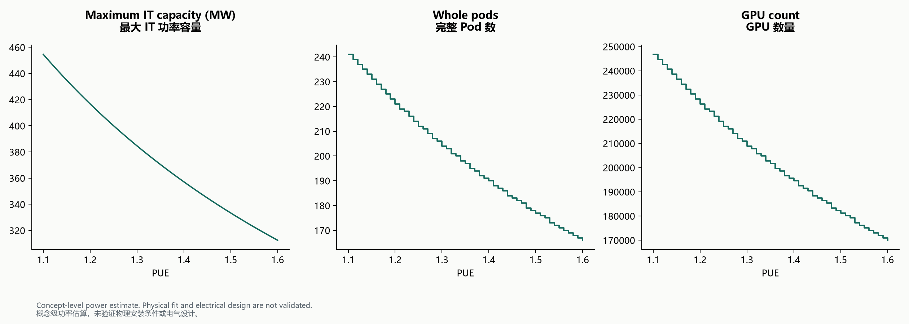

# Phase 1B acceptance / Phase 1B 验收记录

Status: accepted for the demonstrated Phase 1B scope. Evidence combines local automated tests, an agent-run live baseline request, user-run live CLI screenshots, and visual inspection of the generated PNG. No later phase is included.

状态：所演示的 Phase 1B 范围验收通过。证据包括本地自动化测试、Agent 执行的真实基准请求、用户执行真实 CLI 后提供的截图，以及生成 PNG 的视觉检查。不包含后续阶段。

## Acceptance results / 验收结果

| Check / 检查 | Evidence and result / 证据与结果 |
| --- | --- |
| Baseline / 基准 | Live `calculate_capacity`: 500 MW, PUE 1.2; 221 pods, 7,072 racks, 226,304 GPUs; used 498.15168 MW, remaining 1.84832 MW. / 真实工具计算与原 baseline 一致。 |
| Follow-up / 上下文追问 | User changed facility capacity to 300 MW; PUE stayed 1.2 and other baseline inputs stayed unchanged. 133 pods, 4,256 racks, 136,192 GPUs; used 299.79264 MW, remaining 0.20736 MW. / 用户截图确认参数修改与保留正确。 |
| Comparison / 场景比较 | Live `compare_scenarios`, facility 500 MW: PUE 1.15 → 231 pods / 236,544 GPUs; 1.20 → 221 / 226,304; 1.30 → 204 / 208,896. / 用户完整比较表截图确认三个场景。 |
| Sensitivity / 敏感性 | PUE 1.10–1.60, step 0.01; 51 sample points. Endpoints: 241 → 166 pods, 246,784 → 169,984 GPUs. / 截图确认范围、步长及端点统计。 |
| Plot / 绘图 | Live `generate_capacity_plot` returned a PNG. User opened and supplied it; bilingual titles, axes and scope note are legible, and pod/GPU counts use descending steps. / 用户打开实际 PNG，已检查无明显遮挡或乱码。 |
| Scope / 功能边界 | User asked for breaker and transformer purchase specifications. The reply explained unsupported equipment sizing without inventing specifications. / 双语回复明确模型范围，未编造设备规格。 |
| Automated regression / 自动回归 | 78 offline tests passed after the OpenRouter compatibility fix. / 接口兼容修复后 78 项离线测试通过。 |

## Implementation and limits / 实现与限制

The LLM chooses tools and supplies qualitative prose. Python performs engineering calculations; local validation checks tool arguments and final JSON. The four tools are `calculate_capacity`, `compare_scenarios`, `run_pue_sensitivity`, and `generate_capacity_plot`.

LLM 选择工具并提供定性解释，Python 执行工程计算，本地校验工具参数与最终 JSON。四个工具分别完成容量计算、场景比较、PUE 敏感性扫描及基于计算结果的绘图。

OpenRouter defaults to `openrouter/free`, with paid model IDs blocked and zero input/output token price caps. Its final JSON schema is described in the prompt and checked locally, rather than simultaneously forced during API tool selection. OpenAI retains its API text schema. See [compatibility notes](openrouter_validation.md) and [CLI instructions](agent_cli.md).

OpenRouter 默认免费路由，拒绝付费模型 ID，并设置输入/输出 token 零价格上限。最终 JSON schema 通过提示说明并在本地检查，不在 API 工具选择阶段同时强制文本格式。OpenAI 保留 API 文本 schema。详见[兼容说明](openrouter_validation.md)及[使用说明](agent_cli.md)。

These observations validate the demonstrated interactions, not every model, prompt or future provider availability. Free routing may be slow or rate limited. No remote GitHub Actions execution is claimed. Original notebook execution was verified in the earlier phase report, not rerun for this documentation-only packaging step. RAG, a web UI and detailed electrical design remain outside this release.

这些证据验证已演示的交互，不保证所有模型、问题或未来服务可用性。免费路由可能较慢或限流。不宣称已运行远程 GitHub Actions。原 Notebook 执行结果见早期报告，本次文档及打包步骤不重复执行。RAG、网页界面和详细电气设计不属于本版本。
